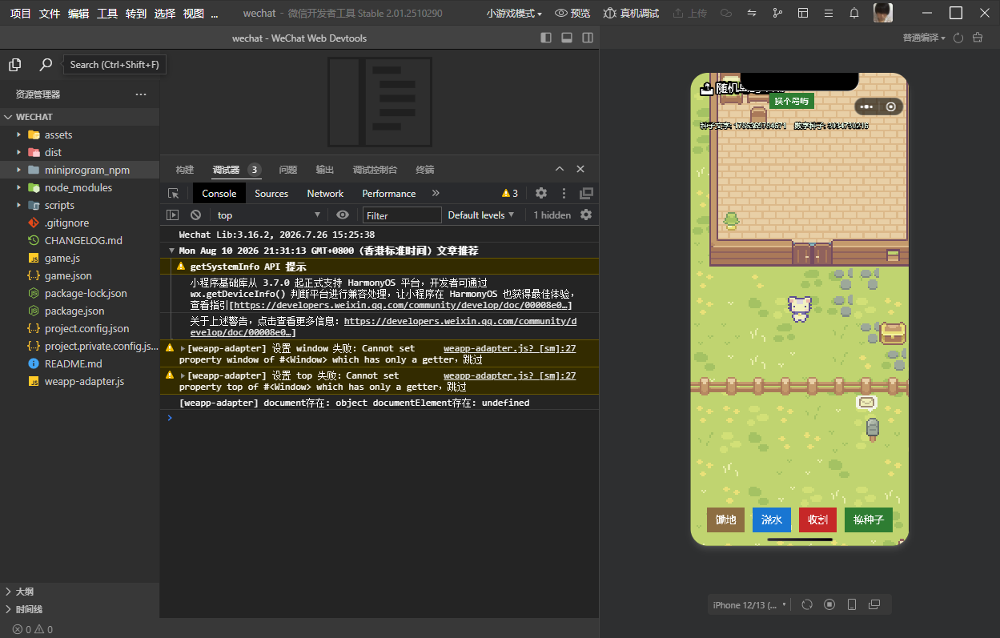

中文 | [English](README.en.md)

# Phaser4 in 微信小游戏 —— 最小可行性验证

验证目的：Phaser 主项目基于 Phaser 4.0.0 开发。在决定是否引入微信小游戏平台之前，
需要先确认"Phaser 4 能否在小游戏运行时环境中直接运行"这一前提是否成立，而非预先
假定必须降级至 Phaser 3。本仓库即为该验证过程的最小可复现示例。

本验证基于一个手游项目开展。

以下为该项目中小游戏接入的示例，已在微信开发者工具中验证可正常运行：
https://github.com/shilover/CuteLandFarm/tree/phaser4-wechat-minigame


## 现状

- **CANVAS 渲染模式：验证通过。**
- **WEBGL 渲染模式：验证通过。**（Phaser 正式场景采用该模式，CANVAS 性能无法
  支撑 Tween、Graphics 圆角面板、程序化图标等场景的渲染量级）

已验证跑通的能力一览：

- 渲染（CANVAS / WEBGL 两种模式）
- 触摸输入（点击变色、拖动跟随）
- `wx.setStorageSync` 持久化存储（跨编译、跨渲染模式切换均保持）
- 真实图片贴图加载
- `Graphics.generateTexture` 纹理烘焙
- JSON 配置文件加载（`this.load.json()`）
- 音频加载、解码与播放（`this.load.audio()` + `this.sound.play()`，原生 `AudioContext`）
- Tween 动画驱动 Container
- 多 Scene 切换（`scene.start`）配合相机 `fadeOut`/`fadeIn`

两种模式下均确认以下功能正常：渲染、触摸输入（点击变色、拖动跟随）、
`wx.setStorageSync` 计数在跨编译及切换渲染模式后的持久化、真实图片贴图加载、
`Graphics.generateTexture` 纹理烘焙（`ProceduralIcons.ts` 重度依赖的技术）、JSON
配置文件加载（`this.load.json()`，Phaser 项目中 hero.json/item.json 等资源均采用
该方式）、音频加载与解码播放（`this.load.audio()` 配合 `this.sound.play()`，可
正常听到点击音效——该环境原生提供真实的 `AudioContext`，Phaser 自动选用了完整
实现的 `WebAudioSoundManager`，而非降级后的空实现，这是本次验证中较为意外的结果，
因为音频历来被认为是小游戏平台适配中最容易出现问题的部分）、Tween 动画驱动
Container、场景切换（`scene.start`）配合相机 `fadeOut`/`fadeIn`（后者对应 Phaser
项目 `SceneTransition.ts` 中 `goToScene` 辅助函数所依赖的核心技术，前者是项目内
按钮悬停、面板弹出、结算数字滚动等 UI 动效的实现基础）。

结论：Phaser 4.0.0（与 Phaser 主项目 `design` 分支版本一致）在微信小游戏环境中
两种渲染模式均可正常运行，"是否需要降级至 Phaser 3"这一前提不再成立，目前评估
无需降级。如需切换验证的渲染模式，修改 `game.js` 中 `type: Phaser.WEBGL` /
`Phaser.CANVAS` 一行即可。

## 运行方式

```
npm install
```

安装完成后，使用微信开发者工具打开本目录，依次点击"工具"→"构建 npm"，再执行
"编译"（依赖变更后需重新构建 npm；仅修改代码则无需此步骤）。

## 关键文件

- `game.js`：项目入口，创建一个最小化的 Phaser Scene（绘制方块与文字，支持触摸
  变色/跟随，点击计数持久化存储）
- `weapp-adapter.js`：核心文件 —— 提供使 Phaser 能够在小游戏环境中正常运行的
  最小适配层，完全自行实现，不依赖任何社区版 weapp-adapter
- `scripts/patch-phaser.js`：`npm install` 后自动执行，用于修补
  `node_modules/phaser` 的 `package.json`（原因见下文）

## 问题记录（按时间顺序）

1. **`window` 为只读属性（getter-only）** —— `GameGlobal` 本身是当前小游戏运行
   时版本预置的类 Window 宿主对象，直接执行 `GameGlobal.window = xxx` 赋值操作会
   在严格模式下抛出异常。解决方式：先通过 `Object.getOwnPropertyDescriptor` 判断
   该属性是否可覆盖，若不可覆盖则跳过赋值，直接使用运行时自带的对象。
2. **`document` 对象存在，但 `documentElement` 属性为 `undefined`** —— 同样是
   运行时预置的不完整对象，无法整体替换（会被判定为不可覆盖），只能在原对象基础
   上补齐缺失字段。
3. **Phaser 4 的 `package.json` 中 `main` 字段指向未编译的源码目录**
   （`./src/phaser.js`）—— 微信"构建 npm"工具不支持新版 `exports` 字段，会回退
   使用 `main` 字段，导致整个未编译源码树（含用不到的 WebGL 调试工具
   `phaser3spectorjs`）被一并打包。解决方式：通过 `scripts/patch-phaser.js` 将
   `main` 字段修改为 `./dist/phaser.js`。
4. **SpectorJS（打包内置于 Phaser dist 的 WebGL 调试工具）会在 Game 初始化阶段
   无条件执行一次 DOM 操作** —— 无论是否选用 WEBGL 渲染模式均会触发，需要补齐
   `document.head`、`document.querySelector('html')`（经查阅源码确认，并非
   `'head'`）、`getElementsByTagName` 等一系列查询类方法的空实现。
5. **`requestAnimationFrame` 在当前版本运行时中已原生提供** —— 最初的实现将其
   委托给 `canvas.requestAnimationFrame`，但 canvas 实例上并不存在该方法，此举
   反而覆盖了本可直接使用的原生实现。经验：对于此类"预期应当存在"的全局对象，
   应先检测其是否存在，避免直接覆盖。
6. **`document.elementFromPoint` 缺失** —— Phaser 处理触摸移动事件时依赖该方法
   判断触摸点下的元素；由于场景中仅有一块 canvas，直接返回该元素本身即可。
7. **切换至 WEBGL 模式后出现 `gl.bindVertexArray is not a function` 报错** ——
   根因并非运行时能力缺失，而是适配层自身问题：此前为避免 `instanceof` 探测到
   未定义标识符而报错，将 `WebGLRenderingContext` 实现为一个空函数占位。这导致
   Phaser 内部依赖 `gl instanceof WebGLRenderingContext` 判断是否需要将
   `bindVertexArray` 等 WebGL2 方法从 `OES_vertex_array_object` 扩展补充到 WebGL1
   的 `gl` 对象上的逻辑始终判定为 `false`，跳过了 Phaser 自身的 WebGL1 兼容补丁。
   解决方式：改为探测真实的 `canvas.getContext('webgl')`，并使用其实际构造函数
   （`Object.getPrototypeOf(gl).constructor`），而非任意的空函数占位。经验：为
   类型标识符设置占位实现时，仅使用来源真实的构造函数才是安全的，任意构造函数
   可能改变 `instanceof` 的判定结果，进而引入新的问题。

8. **图片加载报错 `XMLHttpRequest is not defined`** —— 查阅 Phaser 源码后确认，
   默认的 `ImageFile` 采用 `XHR + responseType: 'blob'` 方式加载，加载完成后通过
   `File.createObjectURL(img, xhr.response, 'image/png')` 将 Blob 转换为
   `img.src`；这与前期调研中"新版 Phaser 大量依赖 Blob，weapp-adapter 难以模拟"
   这一已知限制相符，小游戏环境本身不提供 Blob/XHR。此问题未通过手动实现 Blob
   兼容层解决，而是在源码中找到 Phaser 自带的配置开关：在 Game 配置中设置
   `loader: { imageLoadType: 'HTMLImageElement' }`，可切换至完全不同的加载路径
   （`ImageFile.loadImage`），直接使用 `new Image()` 并设置 `.src`/`.onload`，
   不涉及 XHR/Blob，与适配层中 `Image` 的实现完全匹配。需注意：JSON/文本类资源
   大概率仍需通过 XHR 加载，该问题目前仅在图片加载场景下得到解决。
9. **JSON 加载同样报错 `XMLHttpRequest is not defined`，但不存在类似
   `imageLoadType` 的开关可供绕过** —— `JSONFile` 采用 `responseType: 'text'`，
   不涉及 Blob。经查阅源码确认，`XHRLoader` 实际仅使用 `open`/`setRequestHeader`/
   `overrideMimeType`/`send`/`onload`/`onerror`/`status`/`readyState`/`response`/
   `responseText` 等方法与属性，据此实现了一个最小可用的 `XMLHttpRequest` 类：
   本地相对路径（不含 `http(s)://` 前缀）通过 `wx.getFileSystemManager().readFile()`
   读取包内文件，远程 URL 通过 `wx.request()` 请求。验证结果：Phaser 的配置文件
   加载路径可正常工作。
10. **音频加载未出现明显问题** —— `this.load.audio()` 采用
    `responseType: 'arraybuffer'`，复用 JSON 加载所用的 `XMLHttpRequest` 适配层
    即可正常工作（本地文件通过 `wx.getFileSystemManager().readFile()` 读取，不
    指定 `encoding` 参数时默认返回 ArrayBuffer）。此外，当前版本小游戏运行时
    原生提供真实的 `AudioContext`（`typeof AudioContext === 'function'`），
    Phaser 自动选用了完整实现的 `WebAudioSoundManager` 进行解码播放，无需额外
    编写音频兼容代码。
11. **Tween、Container、多 Scene 切换、相机 `fadeOut`/`fadeIn` 均未出现问题** ——
    在前几轮针对浏览器全局对象的适配完成后，Phaser 自身的对象模型（Tween、
    Container、SceneManager、相机后处理）均按标准方式正常工作，无需额外适配。

综合上述验证过程可得出以下经验：当前版本小游戏运行时（`GameGlobal`）本身已预置
相当数量的"类浏览器"半成品全局对象（如 `window`、`document` 等），与"环境完全
空白、需自行搭建全部基础设施"的传统 weapp-adapter 思路不同——遇到报错时应优先
判断该对象"是否已经存在、只是功能不完整"，而非直接进行整体替换。

## FAQ：为什么 phaser3spectorjs（带"3"）会出现在 Phaser 4 项目依赖中

这是 Phaser 4.0.0 官方包自身的历史遗留依赖，具体原因如下：

1. **命名沿用历史版本** —— 该库为 `node_modules/phaser/package.json` 的
   `devDependencies` 之一。此 WebGL 调试工具最初为 Phaser 3 时代开发，Phaser
   官方升级至 4.0 后延续使用同一包名，未更名为 `phaser4spectorjs`。
2. **本项目 `package.json` 显式声明该依赖的原因** —— 与前文"问题记录"第 3 条
   同源：Phaser 4 的 `package.json` 采用新版 `exports` 字段，微信"构建 npm"工具
   不支持该字段，会回退读取 `main` 字段。若未应用 `patch-phaser.js` 补丁，`main`
   字段将指向未编译源码目录 `./src/phaser.js`，其中包含实际的
   `require('phaser3spectorjs')` 调用（用于 WebGL 调试渲染器）。"构建 npm"沿这些
   require 语句遍历依赖图时，若 `phaser3spectorjs` 未安装于 `node_modules` 中，
   将直接报错提示模块缺失。因此将其显式声明为本项目的直接依赖，以确保无论构建
   流程是否触发该问题，该依赖均已就绪。
3. **该依赖在运行时实际未被调用** —— 实际生效的文件为
   `node_modules/phaser/dist/phaser.js`（生产构建版本，即 `patch-phaser.js` 将
   `main` 字段指向的文件），其第 185967-185969 行内容如下：

   ```js
   if (false)
   // removed by dead control flow
   { var SPECTOR; }
   ```

   Phaser 官方在构建 dist 版本时启用了 `DEBUG=false` 开关，该分支下的
   `require('phaser3spectorjs')` 已被 webpack 作为死代码消除。因此构建产物
   `miniprogram_npm` 中包含的 `phaser3spectorjs` 目录，在实际运行时并不会被
   调用——其存在仅为确保"构建 npm"流程能够顺利完成，属于非必需的伴随依赖，而非
   实际问题。
